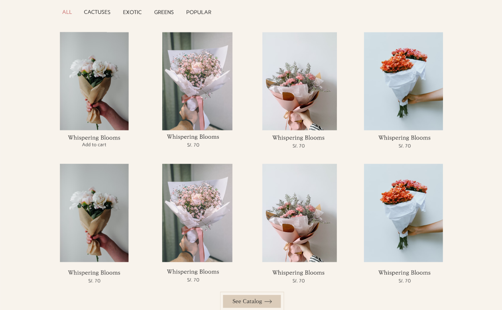
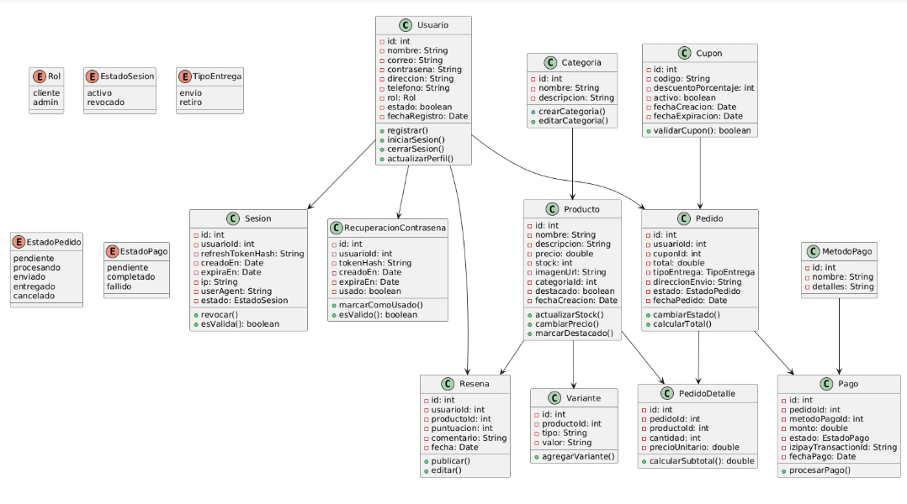
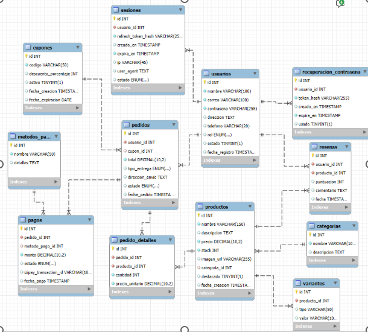

# 🌸 Florería Virtual - Sistema de E-commerce




## 📋 Descripción

Una plataforma de e-commerce moderna especializada en la venta de flores para ocasiones especiales. El sistema permite a los usuarios explorar un catálogo diverso de productos florales, realizar compras online y gestionar pedidos de manera eficiente.

## ✨ Características Principales

- **🌺 Catálogo de Productos**: Amplia variedad de flores organizadas por categorías
- **🛒 Carrito de Compras**: Sistema completo de gestión de pedidos
- **💳 Pasarela de Pago**: Integración con Stripe para pagos seguros
- **🔐 Autenticación**: Sistema de usuarios con JWT y 2FA
- **📊 Panel de Administración**: Gestión completa de productos e inventario
- **📁 Importación Masiva**: Carga de productos mediante archivos Excel
- **🔍 Filtros Avanzados**: Búsqueda por categoría, precio y disponibilidad
- **📱 Responsive Design**: Interfaz adaptable a dispositivos móviles

## 🏗️ Arquitectura del Sistema

### Diagramas



### Arquitectura Técnica
- **Patrón**: MVC (Model-View-Controller)
- **Arquitectura**: Microservicios con Spring Boot
- **Seguridad**: JWT + Spring Security
- **Base de Datos**: JPA + Hibernate con MySQL/H2

## 🛠️ Tecnologías Utilizadas

### Backend
- **Framework**: Spring Boot 3.4.5
- **Lenguaje**: Java 21
- **Módulos Spring**:
  - Spring MVC (API REST)
  - Spring Data JPA (Persistencia)
  - Spring Security (Autenticación/Autorización)
  - Spring Validation (Validaciones)

### Base de Datos
- **Producción**: MySQL
- **Desarrollo/Pruebas**: H2 Database

### Herramientas de Desarrollo
- **Build Tool**: Maven
- **Documentación API**: OpenAPI/Swagger
- **Pasarela de Pago**: Stripe API
- **Autenticación**: JWT (JSON Web Tokens)
- **Logging**: Logback + SLF4J

### Testing
- **Framework**: JUnit 5
- **Mocking**: Mockito
- **Integración**: Spring Boot Test
- **Cobertura**: 90+ pruebas (unitarias + integración)

## 📋 Requisitos del Sistema

- **Java**: JDK 21 o superior
- **Maven**: 3.6 o superior
- **Base de Datos**: MySQL 8.0+ (producción) / H2 (desarrollo)
- **RAM**: Mínimo 512MB, recomendado 1GB
- **Espacio**: 100MB para la aplicación + espacio para BD

## 🚀 Instalación y Configuración

### 1. Clonar el Repositorio
```bash
git clone https://github.com/joehhhh11/floreria.git
cd floreria
```

### 2. Configurar Base de Datos

#### Para Desarrollo (H2 - Automático)
```properties
# application-dev.properties
spring.datasource.url=jdbc:h2:mem:testdb
spring.datasource.driver-class-name=org.h2.Driver
spring.jpa.hibernate.ddl-auto=create-drop
```

#### Para Producción (MySQL)
```properties
# application-prod.properties
spring.datasource.url=jdbc:mysql://localhost:3306/floreria_db
spring.datasource.username=tu_usuario
spring.datasource.password=tu_contraseña
spring.jpa.hibernate.ddl-auto=update
```

### 3. Variables de Entorno
```bash
# JWT Configuration
JWT_SECRET=tu_clave_secreta_jwt_muy_larga_y_segura

# Stripe Configuration
STRIPE_SECRET_KEY=sk_test_tu_clave_secreta_stripe
STRIPE_PUBLISHABLE_KEY=pk_test_tu_clave_publica_stripe

# Database (Producción)
DB_URL=jdbc:mysql://localhost:3306/floreria_db
DB_USERNAME=usuario
DB_PASSWORD=contraseña
```

### 4. Ejecutar la Aplicación

#### Desarrollo
```bash
./mvnw spring-boot:run -Dspring-boot.run.profiles=dev
```

#### Producción
```bash
./mvnw clean package
java -jar target/prueba-0.0.1-SNAPSHOT.jar --spring.profiles.active=prod
```

## 🗄️ Base de Datos

### Estructura Principal
- **usuarios**: Gestión de usuarios y autenticación
- **productos**: Catálogo de flores y productos
- **categoria**: Clasificación de productos
- **orders**: Gestión de pedidos
- **cupones**: Sistema de descuentos

### Script de Inicialización
📂 [Ver script completo](docs/floreria_db.sql)

## 🧪 Sistema de Pruebas

### Ejecutar Todas las Pruebas
```bash
./mvnw test
```

### Tipos de Pruebas Implementadas

#### ✅ Pruebas Unitarias (7 módulos)
- **ProductServiceTest**: Lógica de negocio de productos
- **ProductMapperTest**: Transformación de DTOs
- **ProductControllerTest**: Controladores REST
- **AuthServiceTest**: Autenticación y autorización
- **OrderServiceTest**: Gestión de pedidos

#### ✅ Pruebas de Integración (3 categorías)
- **Repository Tests**: Persistencia de datos (10 tests)
- **Service Integration Tests**: Integración de servicios (11 tests)
- **Controller Integration Tests**: APIs REST completas (8 tests)

### Estadísticas de Cobertura
- **Total de Pruebas**: 90+
- **Cobertura**: Unitarias + Integración completa
- **Autenticación Mock**: Configurada para todas las pruebas
- **Base de Datos**: H2 en memoria para pruebas

### Pruebas Específicas por Módulo
```bash
# Pruebas de productos
./mvnw test -Dtest="*Product*Test*"

# Pruebas de autenticación
./mvnw test -Dtest="*Auth*Test*"

# Pruebas de pedidos
./mvnw test -Dtest="*Order*Test*"
```

## 📡 API Documentation

### Swagger UI
Una vez iniciada la aplicación, accede a:
- **Local**: http://localhost:8080/swagger-ui.html
- **Documentación JSON**: http://localhost:8080/v3/api-docs

### Endpoints Principales

#### 🔐 Autenticación
```
POST /api/auth/login      - Iniciar sesión
POST /api/auth/register   - Registrar usuario
POST /api/auth/refresh    - Renovar token
```

#### 🌸 Productos
```
GET    /api/products             - Listar productos
GET    /api/products/{id}        - Obtener producto
POST   /api/products             - Crear producto (admin)
PUT    /api/products/{id}        - Actualizar producto (admin)
DELETE /api/products/{id}        - Eliminar producto (admin)
POST   /api/products/import      - Importar desde Excel (admin)
```

#### 🛒 Pedidos
```
GET    /api/orders              - Mis pedidos
POST   /api/orders              - Crear pedido
GET    /api/orders/{id}         - Detalle de pedido
```

## 🔧 Configuración Avanzada

### Perfiles de Aplicación
- **dev**: Desarrollo con H2 y logs detallados
- **test**: Pruebas automatizadas
- **prod**: Producción con MySQL y logs optimizados

### Configuración de Seguridad
```yaml
jwt:
  secret: ${JWT_SECRET}
  expiration: 86400000  # 24 horas
  
security:
  enabled: true
  cors:
    allowed-origins: ["http://localhost:3000", "https://tu-frontend.com"]
```

## 📝 Logs y Monitoreo

### Configuración de Logs
```xml
<!-- logback-spring.xml -->
<configuration>
    <appender name="FILE" class="ch.qos.logback.core.rolling.RollingFileAppender">
        <file>logs/app.log</file>
        <rollingPolicy class="ch.qos.logback.core.rolling.TimeBasedRollingPolicy">
            <fileNamePattern>logs/app.%d{yyyy-MM-dd}.log</fileNamePattern>
        </rollingPolicy>
    </appender>
</configuration>
```

### Endpoints de Monitoreo
```
GET /actuator/health     - Estado de la aplicación
GET /actuator/metrics    - Métricas de performance
GET /actuator/info       - Información de la aplicación
```

## 🤝 Contribuir

### Proceso de Desarrollo
1. Fork el repositorio
2. Crea una rama feature: `git checkout -b feature/nueva-funcionalidad`
3. Realiza tus cambios
4. Ejecuta las pruebas: `./mvnw test`
5. Commit: `git commit -m "feat: descripción del cambio"`
6. Push: `git push origin feature/nueva-funcionalidad`
7. Abre un Pull Request

### Estándares de Código
- **Formato**: Google Java Style Guide
- **Testing**: Cobertura mínima del 80%
- **Documentación**: JavaDoc para métodos públicos
- **Commits**: Conventional Commits

## 📄 Licencia

Este proyecto está bajo la Licencia MIT - ver el archivo [LICENSE](LICENSE) para más detalles.

## 👥 Equipo de Desarrollo

- **Backend Developer**: [joehhhh11](https://github.com/joehhhh11)
- **Proyecto**: Florería Virtual E-commerce

## 📞 Soporte

- **Issues**: [GitHub Issues](https://github.com/joehhhh11/floreria/issues)
- **Documentación**: [Wiki del Proyecto](https://github.com/joehhhh11/floreria/wiki)

---

⭐ Si te ha gustado este proyecto, ¡no olvides darle una estrella!


